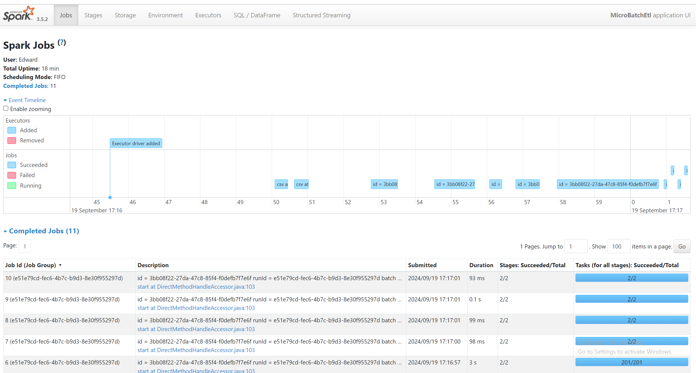

# Spark
 
## How to run:

1. Fetch repository
2. Run py script
3. Go to http://localhost:4040/ to ensure jobs are running
4. Place csv file to `./raw` folder
5. Check outcome results in `./processed` folder:

- `processed` folder contains partitioned data by `neighbourhood_group`.
- `etl.log` contains all run logs.
  
  Result of jobs:
  

## Enhancements:
1. Can be allocated more ram for drivers.
2. Paralellize tasks
3. Cleaning up snapshot checkpoints if there is no need in them

## Worth to mention
1. Task is written poorly, it has controversial points in merge part, verification part, sql part.
2. There are a lot of restrictions with writeStream. 
3. Nothing mentioned about using writeStream in the task at all.
4. If you are utilising readStream it can be treated as static batch, it should be used inside writeStream.
5. You can't use just simple session in sql queries within stream.
